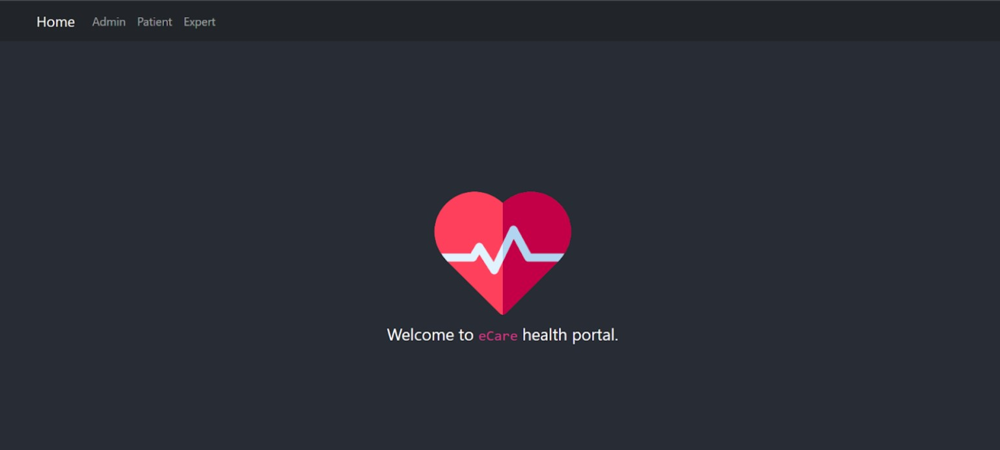
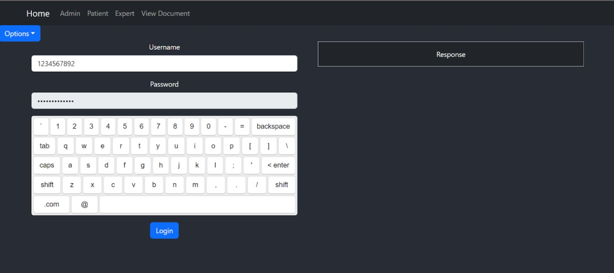

# FCS Project

This is a highly secure web portal made by us as a project in Foundation of Computer Security Course offered in Monsoon Semester 2022. 

## Home Page

## Project Highlights 

- Admin
    - approves and removes the users (suspicious)

- User
    - first upload a health licenses (wait for admin approval)
    - users must be able to view/edit their profile

- Patients
    - view/search/location filter (who, name and location) on details of professionals and hospitals after checkup
    - request his/her documents from professionals and hospitals after checkup
    - buy medicines (using prescriptions)
    - buy medical insurance from any insurance firm
    - claim medical reimbursement from any insurance firm
    - list documents
    - upload and share documents (check verification)
    - delete documents (yes can't be verified anymore)

- Professionals
    - release documents of patients (do NOT store them) and sign them which can be verified by any third party
    - list shared docs
    - sign doc if not verified
    - report a doc suspicious provided shared

- Hospitals
    - sign doc if not verified
    - release documents of patients (do NOT store them) and sign them which can be verified by any third partysign doc if not verified
    - list shared docs
    - report a doc suspicious provided shared

- Pharmacy
    - sell medicines and provide bills (if verified prescriptions)
    - sign doc if not verified
    - report a doc suspicious provided shared

- Insurance firm
    - takes initial money from patients and then make them eligible for medical claims
    - Give medical reimbursement after verification of documents uploaded
    - report a doc suspicious provided shared

- Documents
    - prescriptions, discharge summaries, test results, bills (by professionals and hospitals)
    - bills (by pharmacy)
    - verified automatically

- Payment system
    - assign initial money to each user and in the way of operations manage the money exchange

- Others requirements
    - Payment transaction loggings
    - OTP (at least two) to validate highly sensitive transactions (OTP at time of payment + OTP at time of signing documents)
    - XSS Input Sanitize + Output Encoding 
    - CSRF Token 
    - Blockchain verification 
    - Add nginx configs for DOS attack 
    - DOS Check [set numberofProxies]
    - Highly sensitive transactions with virtual keyboard (For password at time of login - Frontend only)

- Refer `guide.todo` and `eCare APIs.pdf` for more guidelines.

## Virtual Keyboard

   

## Getting Started with Create React App

This project was bootstrapped with [Create React App](https://github.com/facebook/create-react-app).

## Available Scripts

In the project directory, you can run:

### `npm start`

Runs the app in the development mode.\
Open [http://localhost:3000](http://localhost:3000) to view it in your browser.

The page will reload when you make changes.\
You may also see any lint errors in the console.

### `npm test`

Launches the test runner in the interactive watch mode.\
See the section about [running tests](https://facebook.github.io/create-react-app/docs/running-tests) for more information.

### `npm run build`

Builds the app for production to the `build` folder.\
It correctly bundles React in production mode and optimizes the build for the best performance.

The build is minified and the filenames include the hashes.\
Your app is ready to be deployed!

See the section about [deployment](https://facebook.github.io/create-react-app/docs/deployment) for more information.

### `npm run eject`

**Note: this is a one-way operation. Once you `eject`, you can't go back!**

If you aren't satisfied with the build tool and configuration choices, you can `eject` at any time. This command will remove the single build dependency from your project.

Instead, it will copy all the configuration files and the transitive dependencies (webpack, Babel, ESLint, etc) right into your project so you have full control over them. All of the commands except `eject` will still work, but they will point to the copied scripts so you can tweak them. At this point you're on your own.

You don't have to ever use `eject`. The curated feature set is suitable for small and middle deployments, and you shouldn't feel obligated to use this feature. However we understand that this tool wouldn't be useful if you couldn't customize it when you are ready for it.

## Learn More

You can learn more in the [Create React App documentation](https://facebook.github.io/create-react-app/docs/getting-started).

To learn React, check out the [React documentation](https://reactjs.org/).

### Code Splitting

This section has moved here: [https://facebook.github.io/create-react-app/docs/code-splitting](https://facebook.github.io/create-react-app/docs/code-splitting)

### Analyzing the Bundle Size

This section has moved here: [https://facebook.github.io/create-react-app/docs/analyzing-the-bundle-size](https://facebook.github.io/create-react-app/docs/analyzing-the-bundle-size)

### Making a Progressive Web App

This section has moved here: [https://facebook.github.io/create-react-app/docs/making-a-progressive-web-app](https://facebook.github.io/create-react-app/docs/making-a-progressive-web-app)

### Advanced Configuration

This section has moved here: [https://facebook.github.io/create-react-app/docs/advanced-configuration](https://facebook.github.io/create-react-app/docs/advanced-configuration)

### Deployment

This section has moved here: [https://facebook.github.io/create-react-app/docs/deployment](https://facebook.github.io/create-react-app/docs/deployment)

### `npm run build` fails to minify

This section has moved here: [https://facebook.github.io/create-react-app/docs/troubleshooting#npm-run-build-fails-to-minify](https://facebook.github.io/create-react-app/docs/troubleshooting#npm-run-build-fails-to-minify)

<!-- ROADMAP -->
## Roadmap

Clone the repo and open it in suitable IDE for complete project source code. You can also fix the issues and hence contribute.

<!-- CONTRIBUTING -->
## Contributing

Contributions are what make the open source community such an amazing place to be learn, inspire, and create. Any contributions you make are **greatly appreciated**.

1. Fork the Project
2. Create your Feature Branch (`git checkout -b feature/AmazingFeature`)
3. Commit your Changes (`git commit -m 'Add some AmazingFeature'`)
4. Push to the Branch (`git push origin feature/AmazingFeature`)
5. Open a Pull Request

<!-- LICENSE -->
## License

Feel free to clone and modify according to your needs. But please give desirable CREDITS and STAR this repository!  Distributed under the MIT License. See `LICENSE` for more information.

<!-- CONTACT -->
## Contact

Email ID - aaryan20004@iiitd.ac.in

<!-- ACKNOWLEDGEMENTS -->
## Acknowledgements
* Rahul Agrawal - rahul20108@iiitd.ac.in
* Prakhar Rai - prakhar20099@iiitd.ac.in
* Deepam Sarmah - deepam20050@iiitd.ac.in
